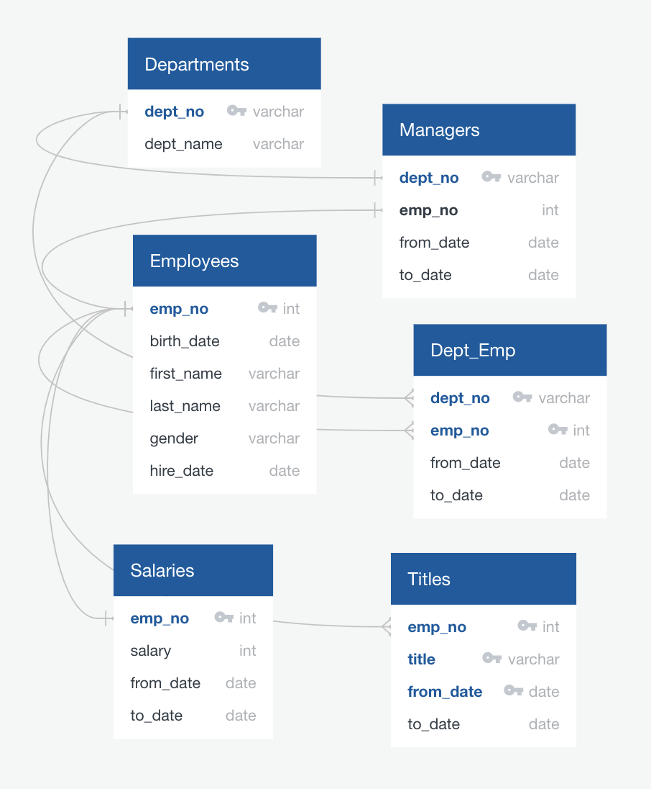

# Pewlett-Hackard-Analysis

## Project Overview
We are working to assist the business(Pewlett-Hackard) in reviewing the records of their half a million employees to determine who will be retiring in the near future and who would be eligible to start a mentorship program. This analysis will help the business understand how many employees are eligible for retirement such that they may prepare to backfill for those role.
## Analysis and Results
 - Entity relationship diagram:
 
 - There are more than 130000 rows of retirement records. We needed to create a new table with only one row per employee because many retiring employees have held multiple positions at the company. Only about 70,000 were produced as a result.
 - We can clearly see the areas where there will be vacancies when we group the unique records by title and arrange them according to the total number of employees retiring with that title. Pewlett Hackard will need 20000 Senior Engineers and Senior Staff soon to fill in vacancies.
 
 - About 1500 mentorship eligible employees. New hires will outnumber mentors, not accounting for the variation of titles, each eligible mentor would need to act as a teacher in classroom full students. This is not sustainable.
 - It is interesting to note that only two retirees hold the title "manager". While managerial department is stable, other groups are not and need new recruits.
 
 
## Summary
Around 1500 employees are eligible for mentorship. We strongly recommend broadening the mentorship eligibility requirements to query for a retirement timeframe as there may not be enough employees to fulfill the mentorship roles prior to retirement, as approximately 1% of the workforce is capable of mentoring and 62% of the workforce is at retirement age.

We could benefit from analysis of department and work structure first, to see whether these positions will be restructured or refilled. General counts of department and title totals in the overall company to know proportionally which areas are hit the hardest. Further sorting of mentors would tell us whether or where we might have holes that require outside hires.
